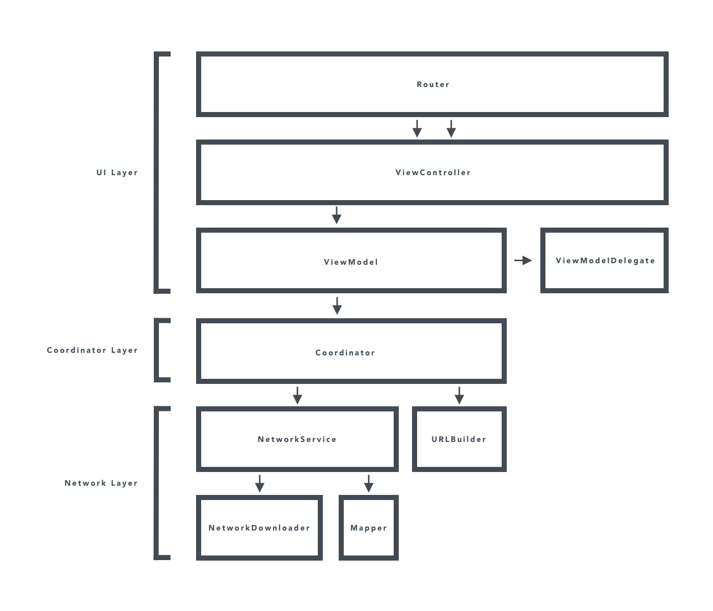

# ImageStream
This app pulls images from the Flickr API and displays them in a collection view. Upon tapping an image in the collection view, a detailed view of that image will be displayed.

## Architecture
The app is achitected in such a way that any API that returns a paginated list of photos can easily be swapped in. For example, suppose we wanted to use the Unsplash photo search API instead of Flickr. We would simply create a URLBuilder for the Unsplash API and a Decodable model for the response, then we pass these into a PhotoSearchCoordinator. Then just inject the PhotoSearchCoordinator into the PhotoCollectionViewModel and we're done.

### High Level Overview

## Todo
- [ ] Add error display
- [ ] Download smaller images for collection view cells
- [ ] Implement bidirectional pagination
- [ ] LRU cache for image data
- [ ] More thorough documentation
- [ ] More thorough unit testing
